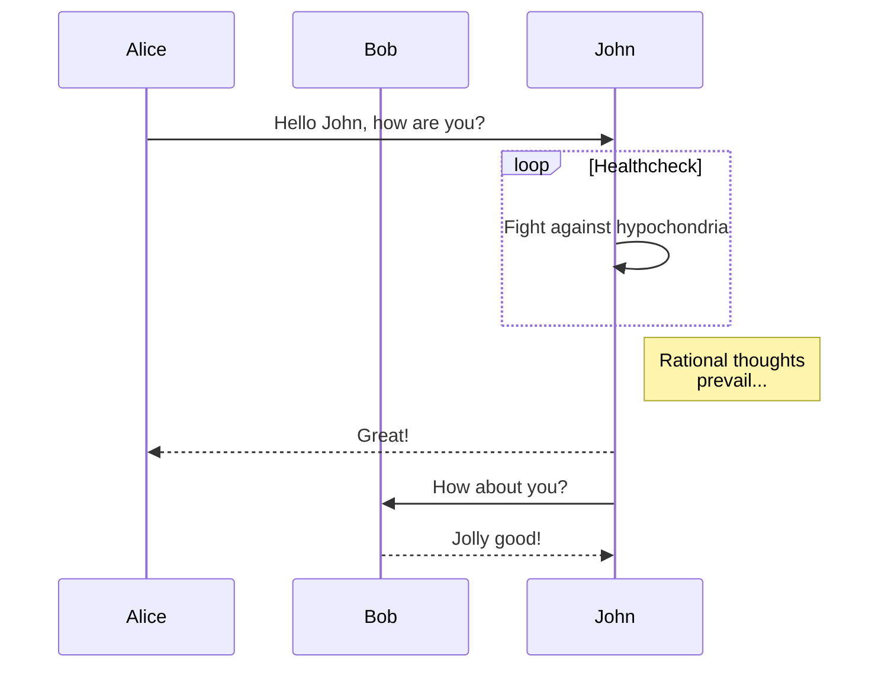
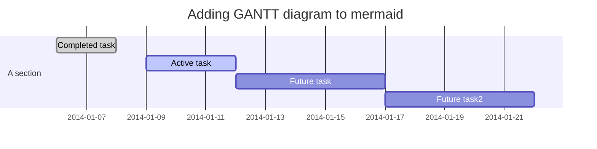
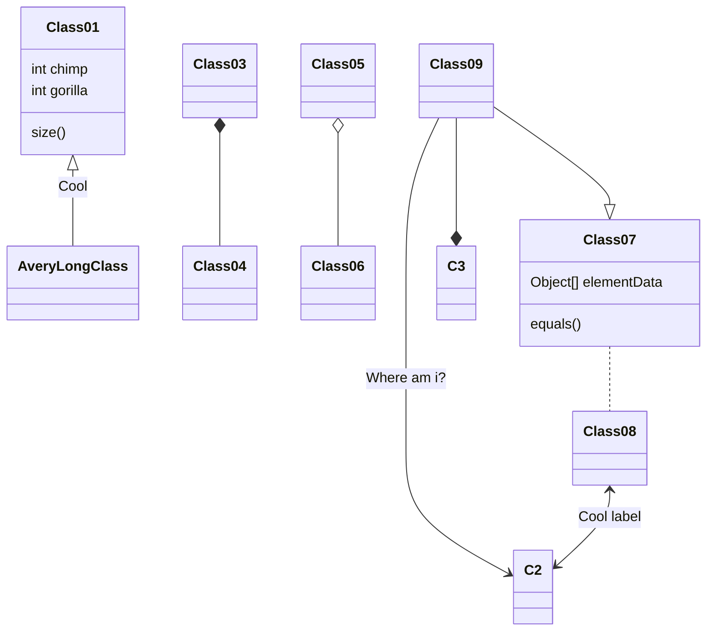

# 为什么要开发 MDBlog ？

## 很可能它并不适合你

首先，我想这个 MDBlog 很可能并不适合你...

* 它没有绚丽的皮肤（虽然理论上讲，你也可以自己做出你想要的皮肤，但成本还是很高的）
* 它不能自动生成按时间排序的博文列表，菜单和列表内容都需要你自己来写
* 为了使用它，你要学习 Markdown 的语法
* 它没有方便的全文搜索（需要借助其他工具来完成）
* 它只支持现代浏览器

## MDBlog 特性

如果你觉得上面那些并不是你最关心的，我们来看看 MDBlog 可以提供什么：

* 以文件作为存储单元，以 Markdown 为存储格式
* 完全自定义的文章管理方式（其实就是没有管理）
* 纯静态无需编译，直接放到 Git Page 上即可
* 多种编程语言代码高亮
* 现有插件支持绘制流程图、类图、甘特图等 mermaid 支持的图。
* 现有插件支持绘制文件夹结构树状图
* 现有插件支持绘制人员组织结构图
* 插件化设计，可以通过扩展实现更多功能

如果上面的功能描述很多你都不能理解，很可能是因为它的使用场景和您很不匹配。

## 一些扩展功能的示例

下面是一些示例，看看这些是不是您所需要的

### 流程图


### 时序图



### 甘特图



### 类图



### 文件结构图

```dirtree!json
[{
  "text": "src",
  "type": "folder",
  "children": [
    {
      "type": "js",
      "text": "test.js"
    }
  ]
}]
```

### 组织关系图

```orgchart!
{
  'name': 'Lao Lao',
  'title': 'general manager',
  'children': [
    { 'name': 'Bo Miao', 'title': 'department manager', 'collapsed': true,
      'children': [
        { 'name': 'Li Jing', 'title': 'senior engineer', 'className': 'slide-up' },
        { 'name': 'Li Xin', 'title': 'senior engineer', 'collapsed': true, 'className': 'slide-up',
          'children': [
            { 'name': 'To To', 'title': 'engineer', 'className': 'slide-up' },
            { 'name': 'Fei Fei', 'title': 'engineer', 'className': 'slide-up' },
            { 'name': 'Xuan Xuan', 'title': 'engineer', 'className': 'slide-up' }
          ]
        }
      ]
    },
    { 'name': 'Su Miao', 'title': 'department manager',
      'children': [
        { 'name': 'Pang Pang', 'title': 'senior engineer' },
        { 'name': 'Hei Hei', 'title': 'senior engineer', 'collapsed': true,
          'children': [
            { 'name': 'Xiang Xiang', 'title': 'UE engineer', 'className': 'slide-up' },
            { 'name': 'Dan Dan', 'title': 'engineer', 'className': 'slide-up' },
            { 'name': 'Zai Zai', 'title': 'engineer', 'className': 'slide-up' }
          ]
        }
      ]
    }
  ]
}
```

## 对记录工具的思考

如果您还有兴趣，可以看看[我对记录工具的思考](/blog/2017/12/我对记录工具的思考.md)
