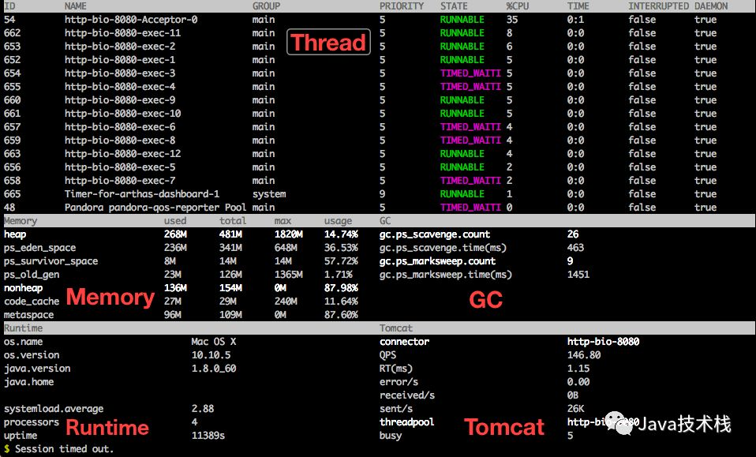
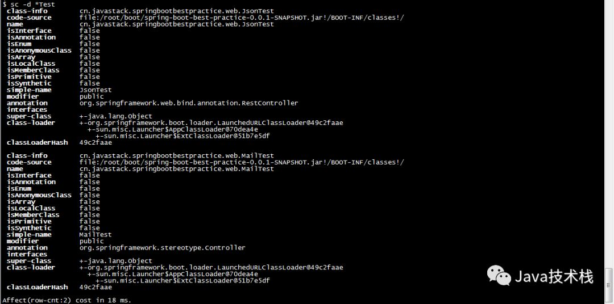

# Arthas 阿里开源 Java 诊断工具

## Arthas

Arthas 是一款阿里巴巴开源的 Java 线上诊断工具，功能非常强大，可以解决很多线上不方便解决的问题。

Arthas 诊断使用的是命令行交互模式，支持JDK6+，Linux、Mac、Windows 操作系统，命令还支持使用 tab 键对各种信息的自动补全，诊断起来非常方便。

* [官方网站](https://alibaba.github.io/arthas/index.html)
* [Github 仓库](https://github.com/alibaba/arthas)

## 特色功能

* Java 进程仪表盘
* 类信息查询
* 方法监控，追踪调用栈，打印方法输入输出
* 线上反编译类
* 热点线程堆栈打印
* JVM 状态监控

## 安装 & 启动

使用 wget 下载到任意目录即可

```bash
wget https://alibaba.github.io/arthas/arthas-boot.jar
```

安装后使用 java -jar 启动即可

```bash
java -jar arthas-boot.jar

# 启动后命令会列出当前机器上所有的 java 进程
# 按编号选择需要调试的进程即可
```

## 使用

启动完成后，会进入 arthas 的控制台，接受各种操作命令。

### help

显示帮助

|命令|说明|
|---|---|
|help|显示帮助|
|keymap|显示可用的快捷键|
|sc|搜索所有已被 JVM 加载的类|
|sm|搜索所有已被 JVM 加载的类的方法|
|classloader|查看classloader的继承树，urls，类加载信息|
|jad|反编译类|
|getstatic|查看类的静态属性|
|monitor|对匹配 class-pattern／method-pattern 的类、方法的调用进行监控|
|stack|输出当前方法被调用的调用路径|
|thread|查看当前线程信息，查看线程的堆栈|
|trace|方法内部调用路径，并输出方法路径上的每个节点上耗时|
|watch|方法执行数据观测,观测范围包括：返回值、抛出异常、入参|
|tt|记录下指定方法每次调用的入参和返回信息|
|jvm|查看当前JVM信息|
|ognl|执行ognl表达式|
|mc|内存编译器，编译.java文件生成.class|
|redefine|加载外部的.class文件，redefine jvm已加载的类|
|dashboard|当前系统的实时数据面板|
|dump|dump 已加载类的 bytecode 到指定目录|
|options|全局选项开关|
|reset|重置增强类，将被 Arthas 增强过的类全部还原|
|version|输出当前目标 Java 进程所加载的 Arthas 版本号|
|quit|退出当前 Arthas 客户端，其他 Arthas 客户端不受影响|
|shutdown|关闭 Arthas 服务端，所有 Arthas 客户端全部退出|
|session|查看当前会话的信息|
|sysprop|查看当前JVM的系统属性(System Property)|
|sysenv|查看当前JVM的环境属性(System Environment Variables)|
|history|打印命令历史|
|cat|打印文件内容，和linux里的cat命令类似|
|pwd|返回当前的工作目录，和linux命令类似|
|mbean|查看 Mbean 的信息|

### dashboard

显示当前系统的实时数据面板，按 ctrl+c 即可退出



### jvm

显示 JVM 信息。

并可输出以下信息：

* THREAD相关
  * COUNT: JVM当前活跃的线程数
  * DAEMON-COUNT: JVM当前活跃的守护线程数
  * PEAK-COUNT: 从JVM启动开始曾经活着的最大线程数
  * STARTED-COUNT: 从JVM启动开始总共启动过的线程次数
  * DEADLOCK-COUNT: JVM当前死锁的线程数
* 文件描述符相关
  * MAX-FILE-DESCRIPTOR-COUNT：JVM进程最大可以打开的文件描述符数
  * OPEN-FILE-DESCRIPTOR-COUNT：JVM当前打开的文件描述符数

### thread

查看当前 JVM 的线程堆栈信息。

```bash
thread # 显示所有线程的信息
thread $id # 显示指定线程的运行堆栈
thread -n 3 # 显示当前最忙的前N个线程并打印堆栈
thread -b # 找出当前阻塞其他线程的线程
```

### sc

“Search-Class” 的简写，查看 JVM 已加载的类信息。

```bash
sc demo.* # 模糊搜索
sc -d $ClassName # 打印类的详细信息，支持通配符，如 *Test
sc -d -f $ClassName # 打印出类的Field信息，支持通配符，如 *Test
```



### sm

“Search-Method” 的简写，查看已加载类的方法信息。

```bash
sm $ClassName # 显示匹配类中所有的方法，支持通配符，如 *Test
sm -d $ClassName $MethodName # 显示匹配类方法的详情，支持通配符，如 *Test
```

### jad

反编译指定已加载类的源代码。

```bash
jad $ClassName # 支持通配符，如 *Test
```

### trace

显示方法内部调用路径，非实时返回的命令并输出方法路径上的总耗时，以及的每个节点上的详细耗时。

```bash
trace -j $ClassName $MethodName # -j 表示跳过 JDK 中的方法路径
```

### monitor

对某个方法的调用进行定时监控。

```bash
monitor $ClassName $MethodName -c 5 # -c 5 表示每5秒统计一次，统计周期，默认值为120秒
```

监控维度说明：

|监控项|说明|
|---|---|
|timestamp|时间戳|
|class|类名|
|method|方法名|
|total|调用次数|
|success|成功次数|
|fail|失败次数|
|rt|平均响应时间|
|fail-rate|失败率|

### watch

观测方法执行数据，能方便的观察到指定方法的调用情况，如：返回值、抛出异常、入参等。

```bash
watch $ClassName $MethodName '{params, returnObj}' -x 2 # -x 2 表示输出打印对象的遍历深度为 2
```

### redefine

加载外部的.class文件，redefine jvm已加载的类。

#### 结合 jad/mc 命令进行代码热修复

```bash
# 反编译类
jad --source-only com.example.demo.arthas.user.UserController > /tmp/UserController.java

# 修改反编译后的源码
vi /tmp/UserController.java

# 编译类
mc /tmp/UserController.java -d /tmp

# 重新加载类
redefine /tmp/com/example/demo/arthas/user/UserController.class
```

#### 上传 .class 文件到服务器的技巧

使用mc命令来编译jad的反编译的代码有可能失败。可以在本地修改代码，编译好后再上传到服务器上。有的服务器不允许直接上传文件，可以使用base64命令来绕过。

在本地:

```bash
# 转换 .class 文件为 base64
base64 < Test.class

# 将输出 base64 的文本，复制备用
```

到服务器上:

```bash
vi result.txt
# 粘贴刚刚复制的 base64 文本，并保存

# 把服务器上的 result.txt 还原为.class
base64 -d < result.txt > Test.class
```

用 md5 命令计算哈希值，校验是否一致

#### redefine的限制

* 不允许新增加field/method
* 正在跑的函数，没有退出不能生效，比如下面新增加的 System.out.println，只有 run() 函数里的会生效

```java
public class MathGame {
    public static void main(String[] args) throws InterruptedException {
        MathGame game = new MathGame();
        while (true) {
            game.run();
            TimeUnit.SECONDS.sleep(1);
            // 这个不生效，因为代码一直跑在 while里
            System.out.println("in loop");
        }
    }

    public void run() throws InterruptedException {
        // 这个生效，因为run()函数每次都可以完整结束
        System.out.println("call run()");
        try {
            int number = random.nextInt();
            List<Integer> primeFactors = primeFactors(number);
            print(number, primeFactors);

        } catch (Exception e) {
            System.out.println(String.format("illegalArgumentCount:%3d, ", illegalArgumentCount) + e.getMessage());
        }
    }
}
```

### 使用 tt 命令获取到 spring context

```bash
tt -t org.springframework.web.servlet.mvc.method.annotation.RequestMappingHandlerAdapter invokeHandlerMethod
# 访问一下
# 可以看到 Arthas 会拦截到这个调用，记录下 index， Ctrl+C 退出 tt
# 用 tt 命令的 -i 参数来指定 index，并且用 -w 参数来执行 ognl 表达式来获取 spring context
tt -i ${index} -w 'target.getApplicationContext()'
# 从spring context里获取任意bean
tt -i ${index} -w 'target.getApplicationContext().getBean("${BeanName}")'
```

### reset

重置增强类，将被 Arthas 增强过的类全部还原，Arthas 服务端关闭时会重置所有增强过的类
