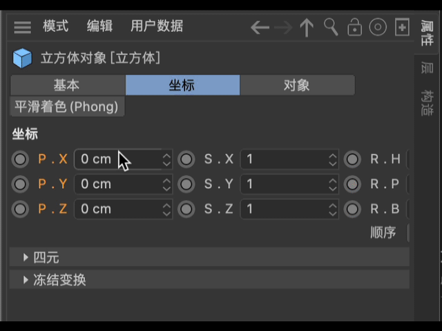

# C4D软件交互

发现 C4D 软件有一些很有特色的交互方式

## 拖拽

C4D 中大量使用了拖拽操作，如将材质拖拽到模型上，将一些预设的素材拖拽到属性值中等等。

对象浏览器中对标签的拖拽

批量设置模型可见的拖拽

标签的拖拽

## 菜单、停靠、标签

菜单、停靠、标签是可以相互切换的，每个菜单都可以停靠在需要的位置上

## 对象层级

利用对象层级关系实现对象绑定，既有通过父级关系的也有通过子级关系的

## 局部渲染

## 方便的数值参数调节

键盘上下级键可直接调整参数数值，shift + 上/下 = 粗调， shift + 上/下 = 微调

拖拽调节按钮可以实现快速增加或减小数值

在调节按钮上右键，可恢复默认值

